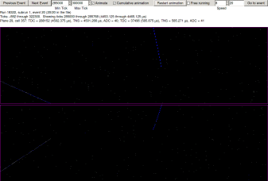

# NOE

This is NOE, a new event display for NOvA, meant to be complementary to
the existing event display. The primary goals are to:

* Prioritize speed.  It allows one to rapidly (1) display a particular
  event or (2) browse a set of events. NOE can display at least 10
  events per second over a remote X connection, provided compression is
  enabled and there is reasonable modern (2017) network connectivity.
  Locally, it should be much faster.

* Allow visualizing events in new (useful) ways, including animations.

* Give easy access to detailed hit and reconstructed (TODO) object
  information for displayed objects.

A non-exhaustive list of things that are not priorities:

* Use or display detailed geometry.

* Display of Monte Carlo information.

* Have the ability to resize the display.

* Be highly customizable, e.g. have user-adjustable colors.

* Have automatic availability of new types of reconstructed objects. 
  Most likely only a fixed list of the most commonly used objects will
  be available.

# Running it

nova -c noejob.fcl artfile.root

The art file must have calibrated hits in it, i.e. rb::CellHits with the
label "calhit".  NOE does not run on artdaq files.

# Name

It's the "New nOva Event display", just to drive people crazy who try to
get "NOvA" written consistently. No, actually the reason is that I wrote
a similar event display for Double Chooz called ZOE, the "Zeroth Outer
veto Event display", and this is the NOvA port of it, N-ZOE, or NOE for
short.

"NOE" is also the nuclear Overhauser effect, which sounds cool, but
has nothing to do with NOvA, as well as the Neoproterozoic Oxygenation
Event, which has even less to do with NOvA.
